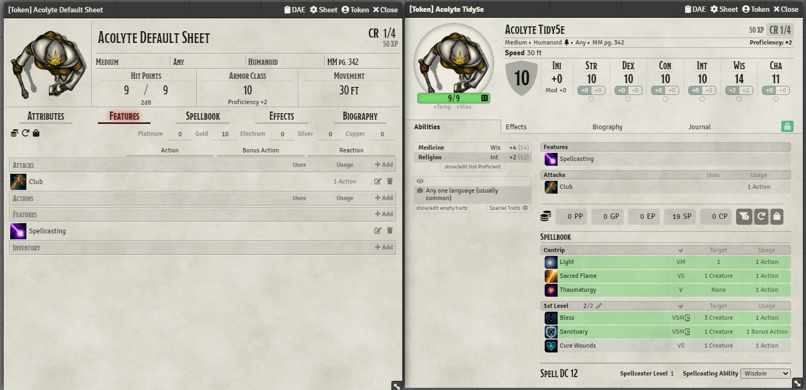
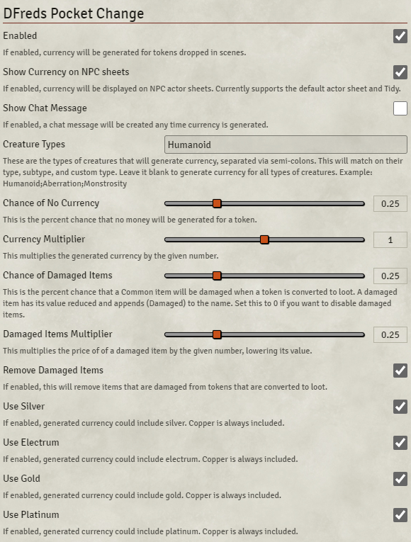

# DFreds Pocket Change

 

__DFreds Pocket Change__ is a FoundryVTT module which automatically adds currency to actors based on the DMG Individual Treasure Tables by Challenge Rating.

## Let Me Sell You This

Have you ever watched as the peaceful NPCs of the town you've lovingly crafted get slaughtered by your players, only for them to ask how much money was in their pockets so they could loot them afterwards? Well, now you can automate that part. The money part. Not the slaughter. That would be weird.

This module need at least one of these modules for work:

- [Loot Sheet NPC 5e](https://foundryvtt.com/packages/lootsheetnpc5e/) by ChalkOne.
- [Item Piles](https://foundryvtt.com/packages/item-piles) by Swap.

## What This Module Does

On the drop of a token onto a scene, Pocket Change generates currency for the token based on its challenge rating.

Pocket Change also adds a currency row onto the NPC sheet. From there, you can do the following:

- Convert All Currency: Changes all coins to the highest possible denomination (like in the PC sheet)
- Generate Currency: This replaces all their currency with new values. These values will be kept for all linked tokens and potentially overridden for non-linked tokens (see When it Automatically Generates Currency).
- Convert to Lootable - This changes the actor sheet to a LootSheet5eNPC, deletes all the Feat and Spell items, applies damage to the rest of the items based on your settings, sets token privileges to Observer for players, and add a treasure overlay icon to the bodies. This allows players to steal that sweet cash and loot straight from the dead dude. Note that this only works on NPC actor sheets for tokens on the canvas.
- Convert to Item Piles - This changes the actor sheet to a Item Piles. This allows players to steal that sweet cash and loot straight from the dead dude.

See here:

You can configure some stuff:

### Friggin' Cool Macros

This module also includes sweet macros. Basically, we got three of these bangers that work for selected tokens:

1. __Generate Currency for Selected Tokens__ - Useful for when you want to disable the automatic generation and do it all on demand (you overachiever you). This can't generate currency for player owned tokens, non-npc actors, and actors that are already loot sheets.
2. __Convert Selected Tokens to LootSheet__ - This macro takes each token and changes their actor sheet to LootSheetNPC, deletes all their Feat items, applies damage to items based on your settings, sets token privileges to Observer for players, and adds a treasure overlay icon to the bodies. This allows players to steal that sweet cash and loot straight from the dead dude. This can't generate currency for player owned tokens, non-npc actors, and actors that are already loot sheets.
3. __Convert Selected Tokens to LootSheet - Custom Damaged Items__ - This macro does the same as the other convert to loot macro, but this one lets you customize the chance of damaged items right in the macro. Rad.
4. __Convert Selected Tokens from LootSheet__ - This macro takes each token and converts them back to the default actor sheet. Note that this does not add any previously deleted spells and features back to the actor.
5. __Convert Selected Tokens to ItemPiles__ - This macro takes each token and changes their actor sheet to Item Piles. This allows players to steal that sweet cash and loot straight from the dead dude. This can't generate currency for player owned tokens, non-npc actors, and actors that are already loot sheets.

## When it Automatically Generates Currency

It only generates currency if all of the following are true:

- The module is enabled (configurable).
  
  > Sort of the whole point of this thing but hey, now you can temporarily turn it off.

- It passes the configurable percent threshold. This allows currency to be generated for only a certain percentage of actors.

  > Not every random acolyte should have money you know!

- The actor is not a loot provided by Loot Sheet NPC 5e. This avoids any conflicts for loot sheet actors that have manually entered currency.
- The actor is not a loot provided by Item Piles. This avoids any conflicts for loot sheet actors that have manually entered currency.

  >  I wouldn't want to mess up your perfectly balanced loot chests!

- The actor is not a linked actor. This avoids situations with modifying important NPCs data.

  > Now the big bad evil guy won't be randomly receiving cash! I bet he would be less evil if he did, though.

- The actor is an NPC. This avoids messing with any data related to player characters.

  > I'm sure you have cooler ways to mess with player characters anyway.

- The actor has a type that matches the configuration provided in the settings.

  > It would be a bit weird if that wolf your players slew had some coins shoved up its nether regions. But hey, maybe that sounds fun, too. Go nuts!

- The actor does not have a player owner. This avoids situations where we're generating currency for NPCs that players can actively control and drag onto the scenes.

  > We wouldn't that silly sidekick the party controls that you forgot to turn into a linked character for some reason to start having his pockets generate money.

- The user is a GM. The final catch-all to make sure only GMs are generating currency.

  > Take that you pesky players!

## API

### Generate currency for selected tokens

`game.modules.get("dfreds-pocket-change").api.generateCurrencyForSelectedTokens(ignoreRating = false) => void`

For all selected tokens, generate currency for them

| Param | Type | Description |
| ---   | ---  | ---         |
| ignoreRating | `boolean` | (optional) if true it will generate a random currency without the rating check |

### Convert selected tokens to lootable sheets

`game.modules.get("dfreds-pocket-change").api.convertSelectedTokensToLootSheet(chanceOfDamagedItems, damagedItemsMultiplier, removeDamagedItems) => void`

For all selected tokens, convert them to lootable sheets.
Adapted from the convert-to-lootable.js by @unsoluble, @Akaito, @honeybadger, @kekilla, and @cole.

**NOTE:** You need the module [Loot Sheet NPC 5E](https://foundryvtt.com/packages/lootsheetnpc5e/) enable and activate

| Param | Type | Description |
| ---   | ---  | ---         |
| chanceOfDamagedItems | `number` | (optional) A number between 0 and 1 that corresponds to the percent chance an item will be damaged |
| damagedItemsMultiplier | `number` | (optional) A number between 0 and 1 that will lower a damaged items value |
| removeDamagedItems | `boolean` | (optional) If true, damaged items will be removed from the token rather than marked as damaged |

### Revert selected tokens from lootable sheets

`game.modules.get("dfreds-pocket-change").api.revertSelectedTokensFromLootSheet() => void`

For all selected tokens, convert them back from lootable sheets.

### Convert selected tokens to item piles

`game.modules.get("dfreds-pocket-change").api.convertSelectedTokensToItemPiles(userOption, imgPath, light) => void`

For all selected tokens, convert them to item piles.

**NOTE:** You need the module [Item Piles](https://foundryvtt.com/packages/item-piles) enable and activate

| Param | Type | Description |
| ---   | ---  | ---         |
| userOption | `number` | (optional) the type of convertion by default is 1. You've got 4 options to choose from: 0 = No Special Effect, Coin roll and -if enabled- Item Pile Transformation Only, 1 = Light Effect only, 2 = Change Image Only, 3 = Both Image Change and Light effect |
| imgPath | `string` | (optional) the path to the image by default is the one set on the module setting  |
| light | `light` | (optional) explicit light effect to use if none is passed a default one is used |

As is, out of the box, this macro: (1) turns the token into an Item Pile, (2) Rolls and adds random coins and (3) adds a Light Effect. If that's good for you, then you don't need to change anything at all.

**Want to Change the Token Image and/or add a Light Effect (or neither)?**

You've got 4 options with option `userOption` to choose from:
- 0 = No Special Effect, Coin roll and -if enabled- Item Pile Transformation Only 
- 1 = Light Effect only
- 2 = Change Image Only
- 3 = Both Image Change and Light effect

#### USER OPTION EXAMPLES

##### No Visual Change, Roll Random Coin, Turn into Item Pile (Option 0)

&nbsp;

##### Add Light Effect Only, Roll Random Coin, Turn into Item Pile (Option 1)

(no coins shown after executing macro was not a mistake, there is a percent chance to not receive any coins)

&nbsp;

##### Change Token Image Only, Roll Random Coin, Turn into Item Pile (Option 2)

&nbsp;

##### Change Token Image & Add Light Effect, Roll Random Coin, Turn into Item Pile (Option 3)

## My Philosophy

I've noticed over the months that a lot of FoundryVTT modules lack focus and good coding practice. A user should never be in a situation where they forget what any given module does. Additionally, a power user should never be totally lost on what's going on in a module if they dive into it.

In case anyone out there in the void is curious, this is my philosophy when it comes to implementing modules.

- Code should be easy to read, self-documenting, and contain JSDocs for any public functions
- Modules should do one thing, and one thing only. No "Quality of Life" catchalls from me. NO SIREE BOB.
- That thing the module does should do it well, with a minimum amount of initial configuration. It should "[Just Work](https://upload.wikimedia.org/wikipedia/commons/b/bf/ToddHoward2010sm_%28cropped%29.jpg)".
- Additional configuration should only be added if it really makes sense. If the configuration starts to change the thing the module does well, it shouldn't be there.
- Readmes (like this) should be funny AND informative. Please create a pull request if you think it could be funnier or informativer.

## Issues

Any issues, bugs, or feature requests are always welcome to be reported directly to the [Issue Tracker](https://github.com/DFreds/dfreds-pocket-change/issues ), or using the [Bug Reporter Module](https://foundryvtt.com/packages/bug-reporter/).

## License

This package is under an [MIT license](LICENSE) and the [Foundry Virtual Tabletop Limited License Agreement for module development](https://foundryvtt.com/article/license/).

## Credit

Thanks to anyone who helps me with this code! I appreciate the user community's feedback on this project!

- [NPC to Coin Pile](https://github.com/Shuggaloaf/NPC-to-Coin-Pile) ty to [Shuggaloaf](https://github.com/Shuggaloaf)
